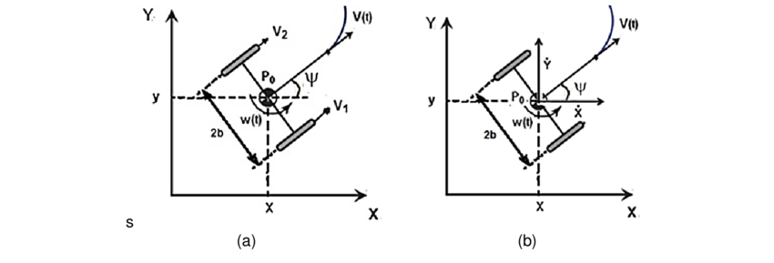
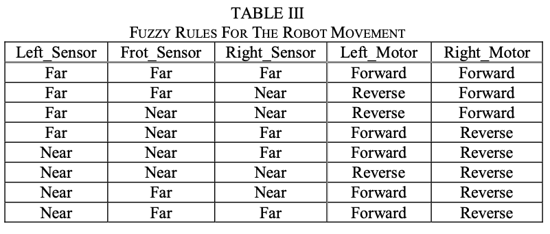

# Actividad 5.4 Laboratorio FLC

*Este repositorio contiene la versión más nueva y actualizada del documento PDF.*

Este repositorio contempla los distintos archivos utilizados durante la realización del laboratorio práctico correspondiente a control difuso.

Este laboratorio, básicamente, consiste en los siguientes ejercicios:
### - Propina:
- Ejercicio 1. Servicio gaussiano
- Ejercicio 2. Triángulos traslapados
- Ejercicio 3. skfuzzy y propina gaussiana
### - Control robot evasor de obstáculos
- Ejercicio 4. Robot diferencial evasor de osbtáculos con 3 sensores, 2 motores, y reglas predefinidas para el accionamiento de los actuadores.

  

  

